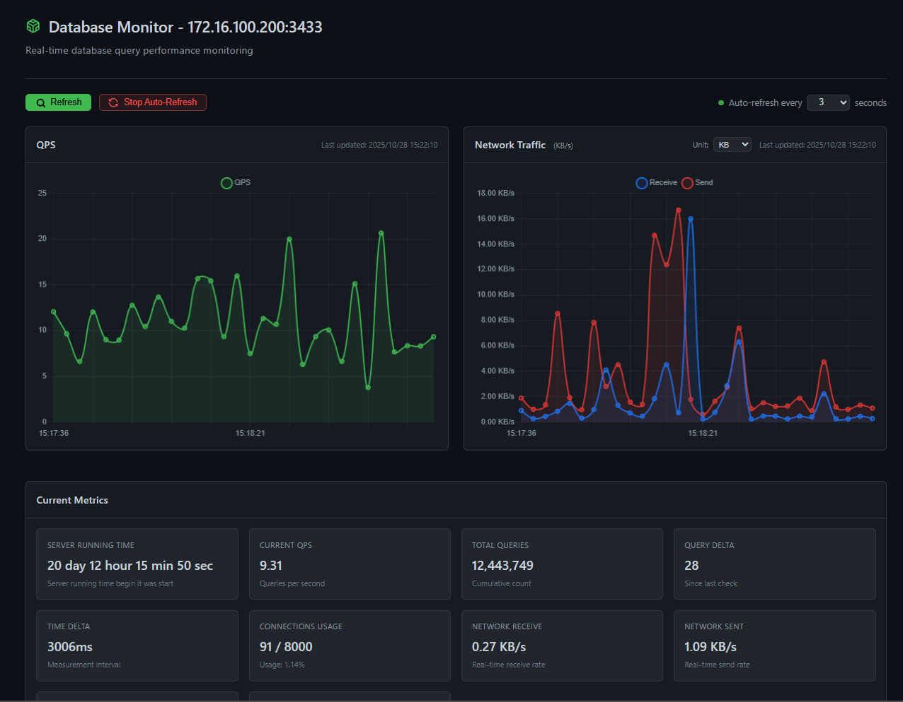

# MySQL 指标监控器（纯响应式架构）

    

## 模块速览

- [基于 RabbitMQ 实现的监控指标接收器模块](https://github.com/JesseZ332623/Project-SQL-Monitor/tree/main/indicator_receiver/src/main/java/com/jesse/indicator_receiver)

- [数据库指标监视器模块](https://github.com/JesseZ332623/Project-SQL-Monitor/tree/main/sql-monitor/src/main/java/com/jesse/sqlmonitor)

### [Apache License Version 2.0](https://github.com/JesseZ332623/Project-SQL-Monitor/blob/main/LICENSE)

*Lats Update: 2025.10.26*