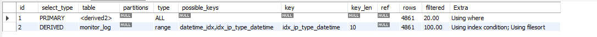

# MySQL SELECT EXPLAIN 查询计划分析概要

这是一次查询计划分析的结果：

各个字段通常的含义如下：

### `id` 查询标识符，表示 SELECT 查询的序列号

- id 相同：执行顺序从上至下
- id 不同：存在子查询，id 越大的越先被执行
- id 为 NULL：最后执行，通常表示一个结果集，比如来自 UNION 的结果

### `select_type` 查询类型，用于区分普通查询，子查询，联合查询等

- SIMPLE：简单的 SELECT 查询，不含子查询、联合查询等
- PRIMARY：查询若包含子部分，最外层的查询被标记为 PRIMARY
- SUBQUERY：在 SELECT 或 WHERE 列表中包含了子查询
- DERIVED：在 FROM 列表中包含的子查询被标记为 DERIVED（衍生表），MySQL 会递归执行这些子查询，把结果放在临时表里
- UNION： 若第二个 SELECT 出现在 UNION 之后，则被标记为 UNION
- UNION RESULT：从 UNION 表获取结果的 SELECT

### `table` 访问的表

- 有些时候不一定是表名，也可以是 <derivedN> 其 N 就是 `id` 列的值， 
  表示该行引用的的 id 为 N 的行的衍生表。
- 如果结果是 <unionM,N>，表示该行引用的是 `id` 为 M 和 N 行的 UNION 结果

### `partitions` 匹配的分区

- 如果表创建了分区，这个字段显示查询将访问的分区，非分区表则为 NULL。

### `type` 访问类型，表示 MySQL 在表中找到所需行的方式

**从好到坏依次是：**

- system：表只有一行记录（等于系统表），这是 const 类型的特例。

- const： 通过索引一次就找到了，const 用于比较 主键索引 或 唯一索引 的所有部分。因为只匹配一行数据，所以非常快。

- eq_ref：类似 ref，区别在于使用的索引是 唯一索引。 
  对于每个来自前表的索引键，当前表中只有一条记录与之匹配。
  常见于主键或唯一索引扫描，作为表的连接条件。

- ref：使用 非唯一性索引 进行扫描，返回匹配某个单独值的所有行。

- range：只检索给定范围的行，使用一个索引来选择行。
  Key 列显示使用了哪个索引。一般就是在你的 WHERE 语句中出现了 BETWEEN、<、>、IN 等的查询。

- index： 全索引扫描。与 ALL 类似，但只遍历索引树。这通常比 ALL 快，因为索引文件通常比数据文件小。

- ALL： 全表扫描，性能最差。意味着 MySQL 必须扫描整张表来找到需要的行。

### `possible_keys` 可能用到的索引

- 显示查询可能使用哪些索引来查找。如果为空，表示没有可能的索引。

### `key` 实际使用的索引，显示查询实际使用的索引。如果为 NULL，则没有使用索引

*Tips：有可能 possible_keys 有列，而 key 显示 NULL。
这种情况发生在 MySQL 认为使用索引的效率不如全表扫描时（例如表中数据量很小）*

### `key_len` 使用的索引长度

可以检查是否充分利用了索引
（例如，一个复合索引 (a, b, c)，如果 key_len 只计算了 a 的长度，说明只用了索引的第一部分）。

### `ref` 索引的引用，显示 key 列记录的索引，是使用哪一列或常量与索引进行比较，从而从表中选择行

- 常见值：

  - const：常量值

  - 库名.表名.字段名：某个表的某个字段

  - func：使用函数的结果

### `rows` 预估需要扫描的行数

根据表统计信息及索引选用情况，
大致估算出找到所需的记录需要读取的行数。（注意这是一个估算值）

### `filtered` 按条件过滤的百分比

表示存储引擎返回的数据在服务器层过滤后，
剩余的行数占 rows 列估算行数的百分比。（注意这是一个估算值）

### Extra 额外信息，包含重要细节

- 常见值：

- Using index： 表示使用了 覆盖索引，即查询的列都包含在索引中，无需回表查询数据行。性能极佳。

- Using where： 表示在存储引擎检索行后，MySQL 服务器再次进行了条件过滤。

- Using temporary： 表示 MySQL 需要使用临时表来存储结果集，常见于排序 ORDER BY 和分组查询 GROUP BY。通常需要优化。

- Using filesort： 表示 MySQL 无法利用索引完成排序，而是使用外部排序。这意味着它需要额外的排序步骤，通常需要优化。

- Using join buffer： 表示在连接查询时，使用了连接缓冲区来提高性能。

- Impossible WHERE： WHERE 子句的值总是 false，无法获取任何行。